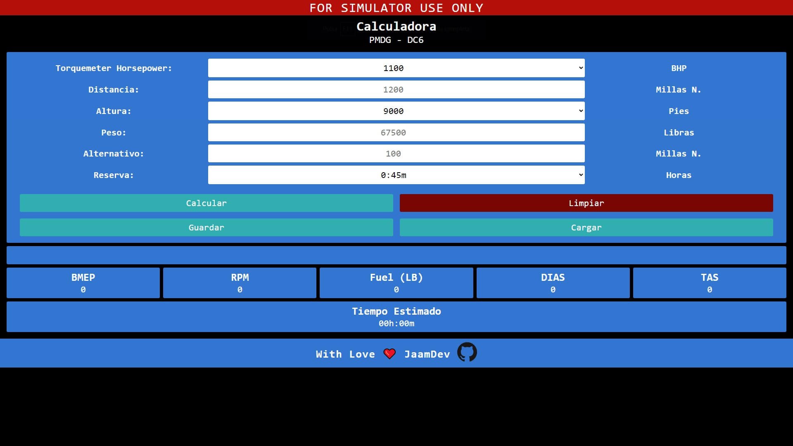

# DC6 - Fuel Calculator

Calculadora para automatizar el cálculo de combustible necesario para llevar en el DC-6A/B de [PMDG](https://pmdg.com) para el vídeojuego [Microsoft Flight Simulator 2020](https://flightsimulator.com).

Solo muestra el combustible para el crucero, sin tener en cuenta el necesario para taxi o para el ascenso y el descenso.

## Por qué lo hice:
No existía una herramienta automatizada para hacer los cálculos y siempre los tenía que hacer a mano perdiendo un tiempo, así que me decidí hacerlo ya que también presentaba ser un divertido reto.

## Lo que aprendí:
Este proyecto hizo que tuviese un conocimiento más profundo de la manipulación de objetos en **JavaScript**, cómo crearlos, modificarlos y consumirlos.

También aprendí más sobre los elementos input y select como por ejemplo la extracción de sus datos para luego usar esos datos en otra parte de la aplicación.

Un elemento option desactivado te dará como valor _**undefined**_.

## Cómo usarlo
Solo hay que introducir en cada campo los datos y te dará el _**combustible**_ necesario en _**libras**_ que se tendrá que cargar en la aeronave para recorrer la distancia.

Mostrará el _**BMEP**_ y las _**RPM**_ que hay que configurar para el motor durante el crucero.

También mostrará una velocidad estimada del avión según el peso y altura introducidas en D.I.A.S. (Dial Indicator Airspeed) y T.A.S (True Airspeed).

Y mostrará también una estimación del tiempo necesario para recorrer la distancia introducida.

El campo llamado _**alternativo**_ es para añadir un campo alternativo o lo que es lo mismo: un aeropuerto o aeródromo alternativo. Poner la distancia que hay en millas náuticas desde el destino del plan de vuelo hasta el aeropuerto alternativo.

La _**reserva**_ es para añadir combustible de reserva para eventos no previstos, por defecto añade 45 minutos de combustible de reserva para cumplir con la legalidad, pero se puede seleccionar no añadir nada.

## Tecnologías Usadas

## Vista
